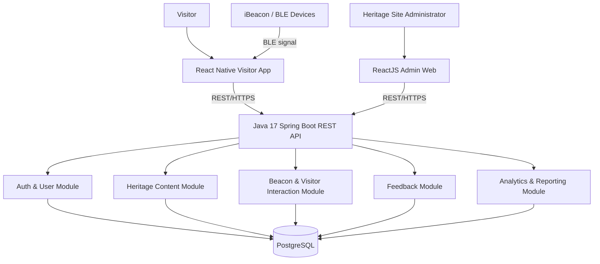

# 4. System Architecture

## 4.1 Architecture style

Smart Heritage uses a **client–server architecture with a modular Spring Boot backend**.

The first implementation is intentionally a **modular monolith**, not microservices:

- Mobile and Web clients are separate frontends.
- Spring Boot is the central REST API/backend.
- PostgreSQL is the shared persistent database.
- iBeacon devices communicate with the Visitor Mobile Application through BLE.
- The backend manages beacon metadata/mapping and stores visitor interaction records.

This gives the team clear module boundaries without unnecessary deployment complexity.

## 4.2 Logical architecture

## 4.3 Component responsibilities

### 1. React Native Visitor App
Responsible for:
- Visitor authentication UI
- Map and heritage browsing
- BLE/iBeacon detection
- Artifact content presentation
- Favorites and visit history
- Feedback submission

### 2. ReactJS Administration Web
Responsible for:
- Administrator authentication
- Heritage/content management UI
- Beacon configuration UI
- Feedback moderation
- Analytics dashboard
- Report export

### 3. Spring Boot Backend
Central REST API and business-logic layer.

#### Auth & User
- Authentication
- Authorization/RBAC
- Visitor profile
- Language preference
- Admin user access

#### Heritage Content
- Heritage Site
- Artifact
- Multimedia
- Multilingual content

#### Beacon & Visitor Interaction
- Beacon registration/configuration
- Beacon-to-artifact mapping
- Visitor interaction recording
- Visit history
- Favorite artifacts
- Duplicate-notification rules

#### Feedback
- Rating
- Visitor feedback
- Admin moderation

#### Analytics & Reporting
- Visitor statistics
- Artifact popularity
- Interaction frequency
- Language preferences
- Report generation/export

### 4. PostgreSQL
Stores:
- Users/roles
- Heritage sites
- Artifacts
- Multimedia metadata
- Beacon configuration
- Visitor interactions
- Visit history
- Favorites
- Feedback
- Analytics/reporting data

The detailed ERD/schema belongs to M2.

### 5. iBeacon Infrastructure
Physical BLE beacons deployed at heritage locations.

Core flow:

`iBeacon → BLE signal → React Native app → resolve beacon/artifact → Backend API → content/interaction data`

## 4.4 Main data flows

### Visitor flow
1. Visitor opens the mobile application.
2. Visitor authenticates and selects a preferred language.
3. Mobile app detects a nearby iBeacon.
4. Mobile app resolves the beacon to an artifact/location.
5. Mobile app requests artifact information from the backend.
6. Backend returns the applicable content.
7. Mobile app displays the content.
8. Visitor interaction is sent to the backend and stored for history/analytics.

### Administrator flow
1. Administrator logs into the web platform.
2. Administrator manages heritage sites, artifacts and multimedia.
3. Administrator configures and assigns iBeacon devices.
4. Administrator moderates feedback.
5. Administrator views analytics/dashboard.
6. Administrator exports reports.

## 4.5 Module ownership for implementation

| Team member | Main backend responsibility | Main client/design responsibility |
|---|---|---|
| M1 | Auth / User / RBAC + integration | Overall architecture / requirements |
| M2 | Heritage Site / Artifact / Multimedia + DB | ERD / Class / Sequence |
| M3 | Beacon / Visitor Interaction / History / Favorite | React Native + BLE |
| M4 | Admin / Content / Translation / Feedback | ReactJS Admin |
| M5 | Analytics / Report / Statistics | Dashboard + testing/deployment |

All members should understand the complete architecture and the interaction between Mobile, Backend, Web, Database and iBeacon infrastructure.
