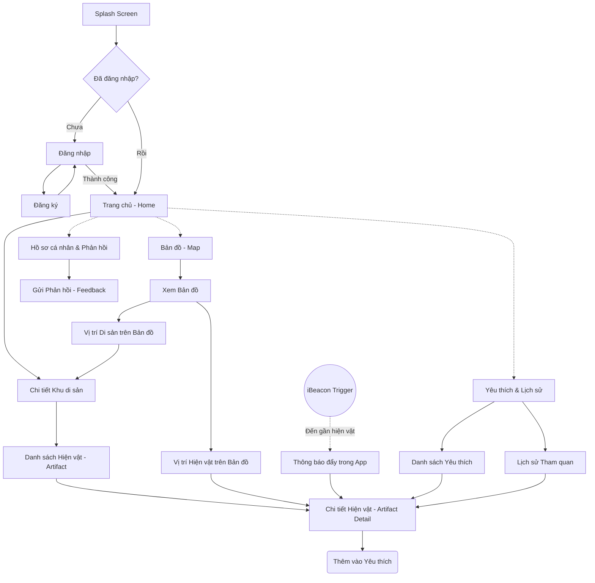

# Mobile Navigation Workflow

Tài liệu này mô tả luồng điều hướng (Navigation Flow) của ứng dụng di động dành cho khách tham quan (Visitor App) theo yêu cầu của M3.

## 1. Sơ đồ Luồng Điều Hướng (Navigation Flow)

## 2. Chi tiết các màn hình chính

### 2.1. Authentication (Register / Login)
- **Login**: Đăng nhập bằng Email/Mật khẩu hoặc Đăng nhập qua mạng xã hội.
- **Register**: Tạo tài khoản cho người dùng mới. Quá trình đăng ký nhanh gọn để khách dễ dàng sử dụng app.

### 2.2. Home / Heritage Site
- Màn hình tổng quan, hiển thị các khu di sản (Heritage Sites).
- Gợi ý các địa điểm, tin tức hoặc sự kiện.
- Điểm khởi đầu để truy cập vào chi tiết của một khu di sản.

### 2.3. Map
- Hiển thị bản đồ tổng quan của khu di sản.
- Đánh dấu vị trí của người dùng hiện tại (nếu có cấp quyền vị trí).
- Đánh dấu (Pin) các khu di vực và các hiện vật (Artifacts).
- Click vào Pin sẽ mở ra Popup thông tin nhanh, từ đó có thể đi đến trang Chi tiết Hiện vật (Artifact Detail).

### 2.4. Artifact (Danh sách Hiện vật)
- Liệt kê các hiện vật có trong một khu di sản hoặc một khu vực trưng bày cụ thể.
- Cho phép tìm kiếm và lọc hiện vật theo thể loại.

### 2.5. Artifact Detail (Chi tiết Hiện vật)
- Hiển thị thông tin đầy đủ về hiện vật: Hình ảnh, mô tả văn bản, âm thanh (Audio guide), video.
- Chức năng thêm vào **Danh sách Yêu thích** (Favorite).
- **Lưu ý iBeacon**: Đây là màn hình sẽ được kích hoạt (hoặc hiện thông báo mời bấm vào) khi hệ thống iBeacon/BLE phát hiện người dùng đang đứng gần hiện vật.

### 2.6. Favorite / History
- **Favorite**: Nơi lưu trữ các hiện vật người dùng quan tâm để xem lại sau.
- **History**: Lịch sử các hiện vật đã tiếp cận hoặc đã xem qua trên app.

### 2.7. Feedback
- Form đánh giá (Star rating) và để lại bình luận góp ý về hiện vật, về khu di sản hoặc về chính ứng dụng.
