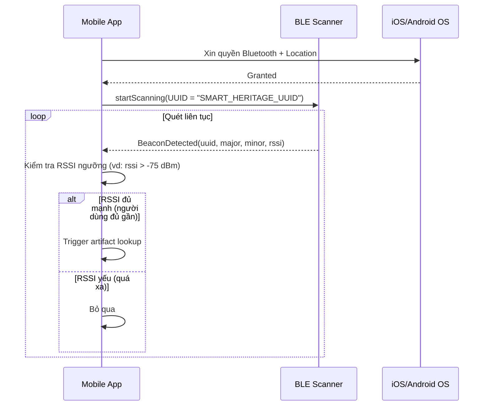
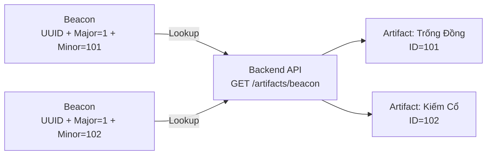
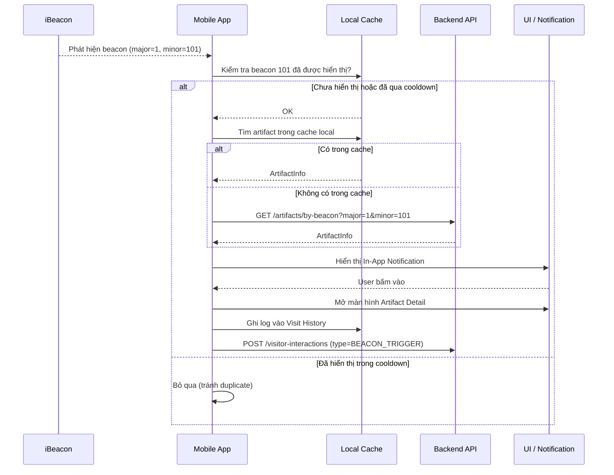
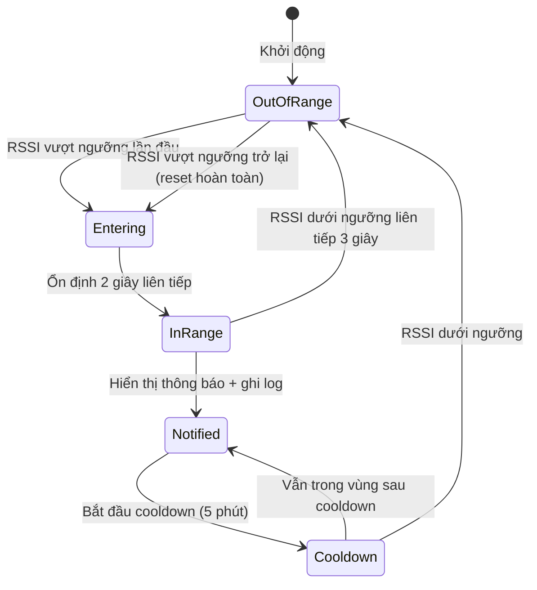

# iBeacon / BLE Flow — LTJ-42

Tài liệu này mô tả thiết kế kỹ thuật cho luồng **iBeacon/BLE** trong ứng dụng React Native (Visitor App), bao gồm:
cách phát hiện beacon, ánh xạ beacon → hiện vật, cơ chế trigger thông tin, và cách tránh thông báo trùng lặp.

---

## 1. Cách Mobile Phát Hiện Beacon

### Công nghệ sử dụng
- **iBeacon** (Apple BLE standard): Beacon phát quảng bá (advertise) tín hiệu BLE liên tục bao gồm 3 giá trị định danh:
  - `UUID`: Định danh nhóm beacon của hệ thống Smart Heritage.
  - `Major`: Định danh khu di sản (Heritage Site ID).
  - `Minor`: Định danh phòng trưng bày / khu vực cụ thể.

### Thư viện React Native đề xuất
- [`react-native-ibeacon`](https://github.com/lg-labs-pentagon/react-native-ibeacon) hoặc **Expo + `expo-location` + `@rnmapbox/maps`** kết hợp với thư viện BLE natively.
- Khuyến nghị: **`react-native-ble-plx`** (Android + iOS) hoặc **`react-native-beacon-ranger`**.

### Luồng phát hiện



### Ngưỡng RSSI (Received Signal Strength Indicator)
| Khoảng cách ước tính | RSSI (dBm) | Hành động |
|---|---|---|
| < 1m | > -55 | Trigger ngay lập tức |
| 1m – 3m | -55 đến -75 | Trigger sau 2 giây dừng ổn định |
| > 3m | < -75 | Bỏ qua |

---

## 2. Beacon → Artifact Mapping

### Cấu trúc định danh Beacon

```
UUID   = "E2C56DB5-DFFB-48D2-B060-D0F5A71096E0"  (toàn hệ thống)
Major  = <heritage_site_id>                         (khu di sản)
Minor  = <artifact_id>                              (hiện vật cụ thể)
```

### Sơ đồ ánh xạ



### API Backend

```
GET /api/v1/artifacts/by-beacon?major={major}&minor={minor}
```

**Response:**
```json
{
  "artifactId": 101,
  "name": "Trống Đồng Đông Sơn",
  "shortDescription": "...",
  "thumbnailUrl": "...",
  "heritageId": 1
}
```

> **Lưu ý thiết kế**: Mobile có thể **cache bảng beacon → artifact** khi khởi động app (offline-first), tránh phụ thuộc mạng trong khu vực bảo tàng có sóng yếu.

---

## 3. Cơ chế Trigger Thông Tin Hiện Vật

### Luồng tổng quát



### Dạng thông báo trong App
- Sử dụng **In-App Banner/Notification** (không phải Push Notification của OS) để xuất hiện tức thì.
- Nội dung: Thumbnail ảnh nhỏ + Tên hiện vật + nút **"Xem chi tiết"**.
- Tự động biến mất sau **8 giây** nếu người dùng không tương tác.

---

## 4. Cách Tránh Duplicate Notification

### Vấn đề
Beacon phát tín hiệu liên tục (mỗi 100ms – 1 giây), nếu không có cơ chế lọc, app sẽ hiển thị thông báo lặp đi lặp lại liên tục khi người dùng đứng yên.

### Giải pháp: Cooldown Timer + Entry/Exit Detection



### Chi tiết cơ chế

| Cơ chế | Mô tả |
|---|---|
| **Debounce Entry** | Phải nhận RSSI ≥ ngưỡng liên tiếp trong **2 giây** mới tính là "Vào vùng". Tránh trigger nhầm do tín hiệu dao động. |
| **Cooldown Timer** | Sau khi đã hiển thị thông báo cho một beacon cụ thể (theo `minor`), đặt cooldown **5 phút**. Trong thời gian này, cùng beacon đó không trigger thêm lần nào nữa. |
| **Exit Detection** | Phải nhận RSSI < ngưỡng liên tiếp trong **3 giây** mới tính là "Ra khỏi vùng". Khi ra khỏi vùng + cooldown hết = reset hoàn toàn, lần vào vùng tiếp theo sẽ trigger lại bình thường. |
| **Local State Map** | Dùng một `Map<minor, { state, lastNotifiedAt }>` lưu trong bộ nhớ (React state / Zustand) để theo dõi trạng thái của từng beacon. |

### Ví dụ code logic (pseudo-code)

```typescript
const RSSI_THRESHOLD = -75;
const COOLDOWN_MS = 5 * 60 * 1000; // 5 phút
const DEBOUNCE_ENTRY_MS = 2000;
const DEBOUNCE_EXIT_MS = 3000;

function onBeaconDetected(beacon: Beacon) {
  const { minor, rssi } = beacon;
  const state = beaconStateMap.get(minor);

  if (rssi >= RSSI_THRESHOLD) {
    // Người dùng đang đến gần
    if (state?.status === 'NOTIFIED') {
      const elapsed = Date.now() - state.lastNotifiedAt;
      if (elapsed < COOLDOWN_MS) return; // Còn trong cooldown -> bỏ qua
    }
    debounceEntry(minor, () => triggerNotification(minor));
  } else {
    // Người dùng đang đi xa
    debounceExit(minor, () => resetBeaconState(minor));
  }
}
```
